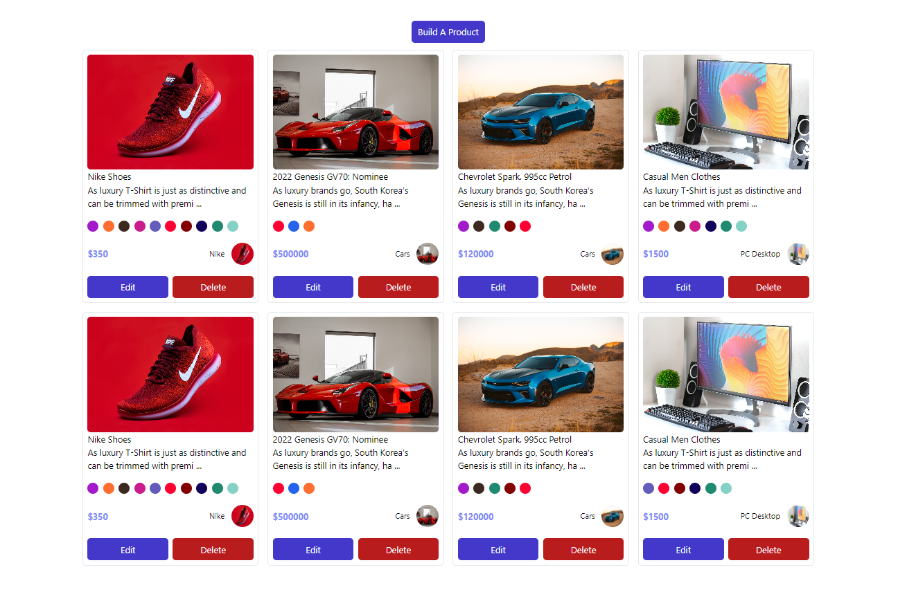

# React TypeScript CRUD Project with Vite, Headless UI, and React Hot Toast

This project is a CRUD (Create, Read, Update, Delete) application built using React, TypeScript, and Vite. It leverages the power of Vite for a fast development experience, TypeScript for static typing, and incorporates additional libraries like Headless UI and React Hot Toast for enhanced UI interactions.


## Live Demo

Check out the live demo to see the project in action:

[](https://drive.google.com/drive/folders/1qCy4LG6vQrFAgfrYhIDf-h7qAEDWZfT1?usp=sharing)

Click the image above to watch the recorded demo.

### Technologies Used

- [React](https://reactjs.org/): A JavaScript library for building user interfaces.
- [TypeScript](https://www.typescriptlang.org/): A superset of JavaScript that adds static typing.
- [Vite](https://vitejs.dev/): A fast build tool that provides a highly optimized development server.
- [Headless UI](https://headlessui.dev/): A set of completely unstyled, fully accessible UI components.
- [React Hot Toast](https://react-hot-toast.com/): A declarative toast library for React applications.
- [Tailwind CSS](https://tailwindcss.com/): A utility-first CSS framework for rapidly building custom designs.
- Tailwind Components: Custom components built using Tailwind CSS for efficient styling and layout.

## Getting Started

1. **Clone the Repository:**

   ```bash
   git clone https://github.com/your-username/your-react-ts-crud-project.git
   ```

2. **Install Dependencies:**

   ```bash
   cd your-react-ts-crud-project
   npm install
   ```

   Or with Yarn:

   ```bash
   yarn
   ```

3. **Run the Development Server:**

   ```bash
   npm run dev
   ```

   Or with Yarn:

   ```bash
   yarn dev
   ```

   This will start the development server, and you can view your application.

Feel free to customize and extend the project according to your specific requirements. Happy coding!